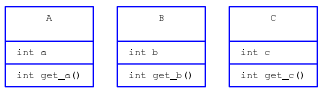
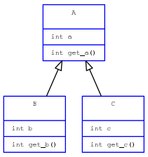

YAUML
~~~~~

A script for generating UML diagrams from `YAML <http://www.yaml.org/>`__
files.

Example
-------

The script lets you use the YAML language in order to build a UML conception
diagram. Let the following file ``./example/ex1/1.yaml``::

    - class: A
      attributes:
        - int a
      methods:
        - int get_a()
    
    - class: B
      attributes:
        - int b
      methods:
        - int get_b()
    
    - class: C
      attributes:
        - int c
      methods:
        - int get_c()

Writing this in a terminal::

    yauml ./example/ex1/1.yaml

would output the resulting ``dot`` file on **stdout** according to the specified
template. In order to get an image, **dot** has to treat the data going out
from ``yauml`` like so::

    yauml ./example/ex1/1.yaml | dot -Tpng -o ./example/ex1/1.png

An equivalent way of writing this is to use some options available in ``yauml``
which allows to directly pass ``yauml``'s output to ``dot``::

    yauml -Tpng -o ./example/ex1/1.png ./example/ex1/1.yaml

Using the default template given with this program, the result
after passing the output to ``dot`` would be:

Let's add some particularities to this conception::

    - class: A
      attributes:
        - int a
      methods:
        - int get_a()
    
    - class: B
      inherits:
        - A
      attributes:
        - int b
      methods:
        - int get_b()
    
    - class: C
      inherits:
        - A
      attributes:
        - int c
      methods:
        - int get_c()
    
and the output through ``yauml`` and ``dot`` would now be:

So far, YAUML handles:

- Classes (can be abstract)
    - attributes
    - methods
- Interfaces
- Relations
    - Simple association
    - Inheritance
    - Use
    - Aggregation
    - Composition
    - Implement
- Relation multiplicity

A more complete example would look like:

.. image:: ./example/ex1/3.png

Documentation
-------------

This comes with a manual explaining all you need to know to use this script. For
more information about the ``dot`` language and the way to set up a template,
see **Graphviz** documentation.

Installation
------------

First, you can configure some variables to suit your needs in the ``Makefile``.
Then, simply run::

    make

and::

    make install

Bash completion
===============

In order for TAB completion to be configured when you install the program,
you have to configure the ``BASH_COMPLETION_DIR`` variable in the ``Makefile``
because it depends on the OS you're using.

Dependencies
------------

To run the script, the following softwares are needed :

- Python 3
- `PyYAML <https://bitbucket.org/xi/pyyaml>`__ (PyYAML for Python2 and Python3
  seem to be in conflict)
- `Graphviz <http://www.graphviz.org/>`__ (optionnal, but the whole point is to use it)

Versions
--------

Versions from v0.1 until v1.0 are not claimed to be backward compatible. Until
v1.0, the program may or may not be heavily changed.
